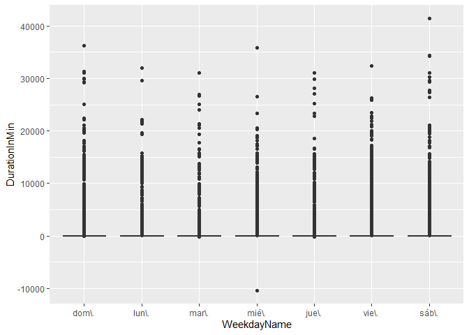
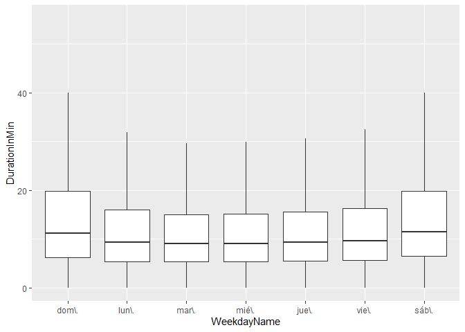
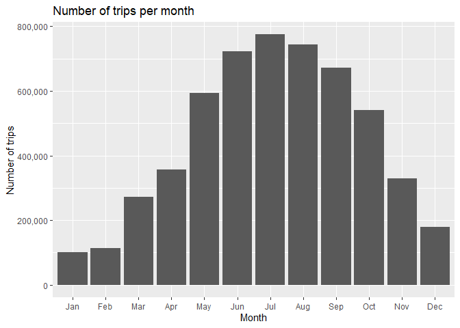
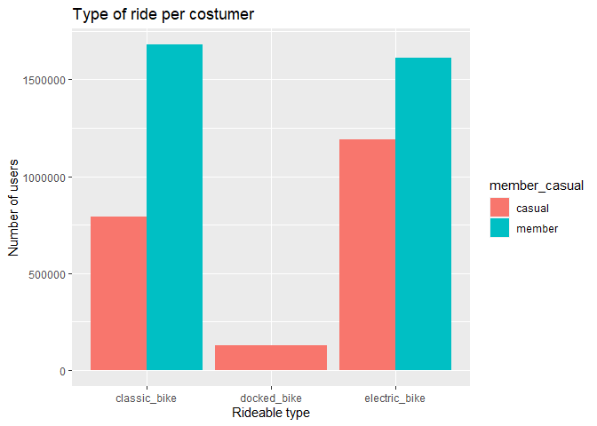
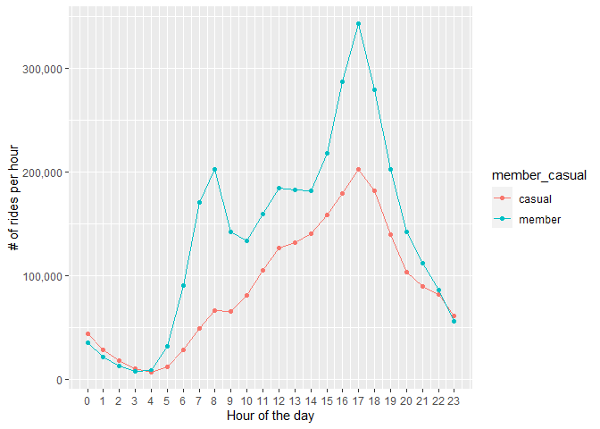
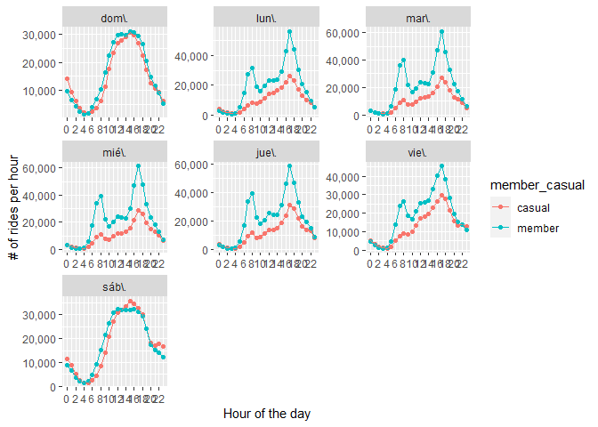

Cyclistic
================
Jorge Gómez
2023-03-10

## Background

Desde la fundanción de Cyclistic la estrategia se ha basado en el amplio
número de segmentos, usando como sistema para adquirir más clientes los
diferentes planes de precio. En estudios anteriores se concluyó que los
usuarios con membresía anual son más redituables que los usuarios
casuales, por lo que la directora de marketing, Lily Moreno, ha decidido
que enfocarse en adquirir más usuarios de este tipo, enfocándose en que
los **<u>usuarios casuales adquieran su membresía anual</u>**.

Se ha decidido que el programa de marketing futuro debe responder las
siguientes 3 preguntas:

- **How do annual members and casual riders use Cyclistic bikes
  differently?**

- **Why would casual riders buy Cyclist annual memberships?**

- **How can Cyclistic use digital media to influence casual riders to
  become members?**

## Data

Data was provided by *Motivate International Inc.*. It is formatted in
CSV files, by month, we are taking 12 months from 2022. Data is stored
in our servers. Data consist in 13 columns:

- ride_id = col_character(),
- rideable_type = col_character(),
- started_at = col_datetime(format = ““),
- ended_at = col_datetime(format = ““),
- start_station_name = col_character(),
- start_station_id = col_character(),
- end_station_name = col_character(),
- end_station_id = col_character(),
- start_lat = col_double(),
- start_lng = col_double(),
- end_lat = col_double(),
- end_lng = col_double(),
- member_casual = col_character()

We will check for empty or null values and de dataset

``` r
# indluding libraries
library(readr)
library(dplyr)
```

    ## 
    ## Attaching package: 'dplyr'

    ## The following objects are masked from 'package:stats':
    ## 
    ##     filter, lag

    ## The following objects are masked from 'package:base':
    ## 
    ##     intersect, setdiff, setequal, union

``` r
library(lubridate)
```

    ## 
    ## Attaching package: 'lubridate'

    ## The following objects are masked from 'package:base':
    ## 
    ##     date, intersect, setdiff, union

``` r
library(ggplot2)
library(forcats)
```

``` r
#reading files
list_of_files <- list.files(path = "../Data/",
                            recursive = TRUE,
                            pattern = "\\.csv$",
                            full.names = TRUE)
all_trips <- readr::read_csv(list_of_files, id = "file_name")
```

    ## Rows: 5667717 Columns: 14
    ## ── Column specification ────────────────────────────────────────────────────────
    ## Delimiter: ","
    ## chr  (7): ride_id, rideable_type, start_station_name, start_station_id, end_...
    ## dbl  (4): start_lat, start_lng, end_lat, end_lng
    ## dttm (2): started_at, ended_at
    ## 
    ## ℹ Use `spec()` to retrieve the full column specification for this data.
    ## ℹ Specify the column types or set `show_col_types = FALSE` to quiet this message.

``` r
weekday_names <- c("Sun","Mon", "Tue", "Wen", "Thu", "Fri", "Sat", "Sun")
```

Check for NA values in dataset

``` r
filter(all_trips, is.na(ended_at) | is.na(started_at) | is.na(rideable_type) | is.na(member_casual))
```

    ## # A tibble: 0 × 14
    ## # … with 14 variables: file_name <chr>, ride_id <chr>, rideable_type <chr>,
    ## #   started_at <dttm>, ended_at <dttm>, start_station_name <chr>,
    ## #   start_station_id <chr>, end_station_name <chr>, end_station_id <chr>,
    ## #   start_lat <dbl>, start_lng <dbl>, end_lat <dbl>, end_lng <dbl>,
    ## #   member_casual <chr>

Number of each type of user

``` r
users <- all_trips %>%
  count( member_casual)
print(users)
```

    ## # A tibble: 2 × 2
    ##   member_casual       n
    ##   <chr>           <int>
    ## 1 casual        2322032
    ## 2 member        3345685

Adding duration per trip

``` r
alltripwithDuration <- select(all_trips, ride_id, rideable_type, started_at, ended_at, member_casual)
alltripwithDuration <- mutate(alltripwithDuration, durationSecs = ended_at - started_at)
alltripwithDuration <- mutate(alltripwithDuration, durationMin = alltripwithDuration$durationSecs/60)
```

Boxplot of Trips per weekday

``` r
##RUN TO SUMMARIZE STATS FOR VARIABLE
tripsWeekday <- select(alltripwithDuration, started_at, ended_at,  member_casual, rideable_type, durationSecs, durationMin) 
tripsWeekday <- tripsWeekday %>%
  mutate(WeekdayName = wday(started_at, label = TRUE), Weekday = wday(started_at, locale =  Sys.getlocale("LC_TIME")), Duration = ended_at - started_at, DurationInMin = Duration/60)
```

Duration of trips per WeekDay

``` r
tripsWeekday %>%
    ggplot() +
    geom_boxplot(mapping = aes(x = WeekdayName, y = DurationInMin))
```

    ## Don't know how to automatically pick scale for object of type <difftime>.
    ## Defaulting to continuous.

<!-- -->

In this boxplot, we can see how are a lot of outliers, even negative
outliers (which does not make sense). Let’s take an example of 1 of them
that lasted for 1000 min, that would be 16 hours!

``` r
#Remove negative durations
  tripsWeekday <- tripsWeekday %>%
    filter(started_at < ended_at)
```

``` r
#Getting IQR 25 & 75:
groupedByDays <-tripsWeekday%>% group_by(WeekdayName)
Qtls <- tapply(tripsWeekday$DurationInMin, tripsWeekday$WeekdayName , quantile)

Q1s <- sapply(1:7, function(i) Qtls[[i]][2])
Q3s <- sapply(1:7, function(i) Qtls[[i]][4])
```

``` r
#Getting IQR Limits
IQRs <- tapply(tripsWeekday$DurationInMin, tripsWeekday$WeekdayName, IQR)
IQRs
```

    ##   dom\\.   lun\\.   mar\\.   mié\\.   jue\\.   vie\\.   sáb\\. 
    ## 15.60000 12.25000 10.95000 10.91667 11.30000 12.10000 15.35000

``` r
lower <- Q1s - 1.5 * Q1s
upper <- Q3s + 1.5 * Q3s
```

``` r
tripswDay <- split(tripsWeekday, tripsWeekday$WeekdayName)

lower[1]
```

    ##   25% 
    ## -3.25

``` r
upper[2]
```

    ##      75% 
    ## 44.45833

``` r
noOutlier <- NULL
for (i in 1:7){
  out <- subset(tripswDay[[i]], (tripswDay[[i]]$DurationInMin > lower[i]) & (tripswDay[[i]]$DurationInMin < upper[i]))
 noOutlier <- rbind(noOutlier, out) 
}
```

Trips Without outliers

``` r
noOutlier %>%
  ggplot() +
  geom_boxplot(mapping = aes(x = WeekdayName, y = DurationInMin), outlier.shape = NA )
```

    ## Don't know how to automatically pick scale for object of type <difftime>.
    ## Defaulting to continuous.

<!-- -->

- Now, the boxplot is clear from positive and negative outliers, and we
  can see the area of the box.

``` r
tripsPerMonth <- noOutlier %>%
  count(month(started_at))
tripsPerMonth$`month(started_at)` <- month.abb[tripsPerMonth$`month(started_at)`]

tripsPerMonth %>%
  ggplot(mapping =  aes(x =`month(started_at)`, y = n)) +
  geom_bar(stat='identity') + 
  scale_x_discrete(limits = month.abb)+
  scale_y_continuous(labels = scales::comma)+
  labs(
    title = 'Number of trips per month',
    x = 'Month',
    y = 'Number of trips'
  )
```

<!-- -->

-Weather and vacations is a direct factor for the number of rides.

``` r
#Trips per month by costumer
tripsPerMonthByConstumer <- noOutlier %>%
  group_by(member_casual, month(started_at)) %>%
  count(member_casual)

tripsPerMonthByConstumer <- tripsPerMonthByConstumer %>%
  mutate(monthName = month.abb[`month(started_at)`])

ggplot(data = tripsPerMonthByConstumer) +
  geom_bar(mapping = aes(x = fct_inorder(monthName), y = n,fill = member_casual), stat='identity', position = "dodge") +
  labs( title = "Number of rides each month per type of user",
        x = "Month",
        y = "# of rides"
  )+
  scale_y_continuous(labels = scales::comma)
```

<!-- -->

- It is very notorious how members are always at the top of number of
  rides, but on wynter, casual rides don’t even reach half of the member
  usage.

``` r
#Trips per weekday and costumer
countOfTripsPerDayCostumer <- noOutlier %>%
  count(Weekday, member_casual) %>%
  mutate(Weekday = weekday_names[Weekday])

countOfTripsPerDayCostumer %>%
  ggplot(mapping = aes(x =fct_inorder(Weekday), y = n, fill = member_casual)) +
  geom_bar(stat = 'identity', position = 'dodge') +
  labs(
    x = "Weekday",
    y = "# of rides",
    
  )+
  scale_y_continuous(labels = scales::comma)+
  scale_fill_discrete(name ="Customer")
```

<!-- -->

- On weekends the number of rides are almost even for the 2 types of
  users.

``` r
#AVG ride duration and costumer

avgDurationByCustomer <- noOutlier %>%
  group_by(member_casual) %>%
  summarize(mean(durationMin))

avgDurationByCustomer %>%
ggplot(mapping = aes(x = member_casual, y = `mean(durationMin)`), color = member_casual ) +
  geom_bar(stat = 'identity')+
  labs(
    x = 'Member',
    y = 'AVG Duration',
    title = 'Average duration'
  )
```

    ## Don't know how to automatically pick scale for object of type <difftime>.
    ## Defaulting to continuous.

<!-- -->

``` r
tripDurationWeekAndCostumer <- noOutlier %>%
  group_by(Weekday, WeekdayName, member_casual)

tripsWeekday %>%
  group_by(Weekday, WeekdayName, member_casual) %>%
  summarize(avgDuration = mean(Duration)/60, .groups = 'drop') %>%
  ggplot(mapping = aes(x = WeekdayName, y = avgDuration, fill = member_casual)) + 
  geom_bar(stat = 'identity', position = 'dodge') + 
  labs(
    title = 'Avg ride duration per day by Costumer',
    y = 'Min'
  )
```

    ## Don't know how to automatically pick scale for object of type <difftime>.
    ## Defaulting to continuous.

<!-- -->

Average duration per trip by member its very linear, showing that it is
not for recreational purposes.

``` r
tripsPerRideAndCustomer <- noOutlier %>%
  count(rideable_type, member_casual)
ggplot(data = tripsPerRideAndCustomer) + 
  geom_bar(mapping = aes(x = rideable_type, y = n, fill = member_casual), stat= 'identity', position = "dodge")+
  labs(
    title = 'Type of ride per costumer',
    x = 'Rideable type',
    y = 'Number of users'
  )
```

<!-- -->

``` r
repeatedhours <- noOutlier %>%
  count(hour(started_at), member_casual)

repeatedhours
```

    ## # A tibble: 48 × 3
    ##    `hour(started_at)` member_casual     n
    ##                 <int> <chr>         <int>
    ##  1                  0 casual        43692
    ##  2                  0 member        35546
    ##  3                  1 casual        28213
    ##  4                  1 member        21836
    ##  5                  2 casual        17561
    ##  6                  2 member        12703
    ##  7                  3 casual        10508
    ##  8                  3 member         7904
    ##  9                  4 casual         7212
    ## 10                  4 member         8763
    ## # … with 38 more rows

``` r
repeatedhours%>%
  ggplot(mapping = aes(x = `hour(started_at)` , y=n,  color = member_casual )) +
  geom_point() +
  geom_line()+
  scale_y_continuous(labels = scales::comma)+
  labs(y = '# of rides per hour',
       x = 'Hour of the day'
       )+
  scale_x_continuous(breaks=seq(0,23,by=1))
```

<!-- -->

``` r
#hist Starting time and day

repeatedhours_day <- noOutlier %>%
  count(hour(started_at),  WeekdayName, member_casual)

repeatedhours_day
```

    ## # A tibble: 336 × 4
    ##    `hour(started_at)` WeekdayName member_casual     n
    ##                 <int> <ord>       <chr>         <int>
    ##  1                  0 "dom\\."    casual        14106
    ##  2                  0 "dom\\."    member         9773
    ##  3                  0 "lun\\."    casual         3861
    ##  4                  0 "lun\\."    member         3039
    ##  5                  0 "mar\\."    casual         2741
    ##  6                  0 "mar\\."    member         2632
    ##  7                  0 "mié\\."    casual         2831
    ##  8                  0 "mié\\."    member         2976
    ##  9                  0 "jue\\."    casual         3592
    ## 10                  0 "jue\\."    member         3446
    ## # … with 326 more rows

``` r
graph <- repeatedhours_day%>%
  ggplot(mapping = aes(x = `hour(started_at)` , y=n,  color = member_casual )) +
  geom_point() +
  geom_line()+
  scale_y_continuous(labels = scales::comma)+
  labs(y = '# of rides per hour',
       x = 'Hour of the day'
  )+
  scale_x_continuous(breaks=seq(0,23,by=2))

graph + facet_wrap(~WeekdayName, scales = 'free')
```

<!-- -->

- Member behavior is very similar through weekdays. From 5 A.M. to 8
  A.M. is a tendency of how rides increase, then it stabilize and
  increases all over again from 3 P.M and reaching its highest peak at 6
  P.M.

- Another thing to notice is that on Saturday and Sunday, the tendency
  of casual and annual members is very similar, this tell us that on
  weekends annual members use the service as recreational.

## Final Comments

1)  **Members use the service in a *monotonous* way. On weekdays the
    peak of usage is at 8:00 hours in the morning and 18:00 in the
    afternoon, what shows us that the bikes are used most likely to go
    to work or school. On the other hand, average ride duration of
    casual members last longer, around 14 min vs almost 11 min that
    lasts for annual members.**

2)  **For casual riders to buy the annual membership, a very good deal
    should be involved, as they use the bikes about only 6 months of the
    year.**

3)  **Cyclistic could show casual riders the benefits of only using the
    bikes not just as a leisure activity, but on a daily basis.**
